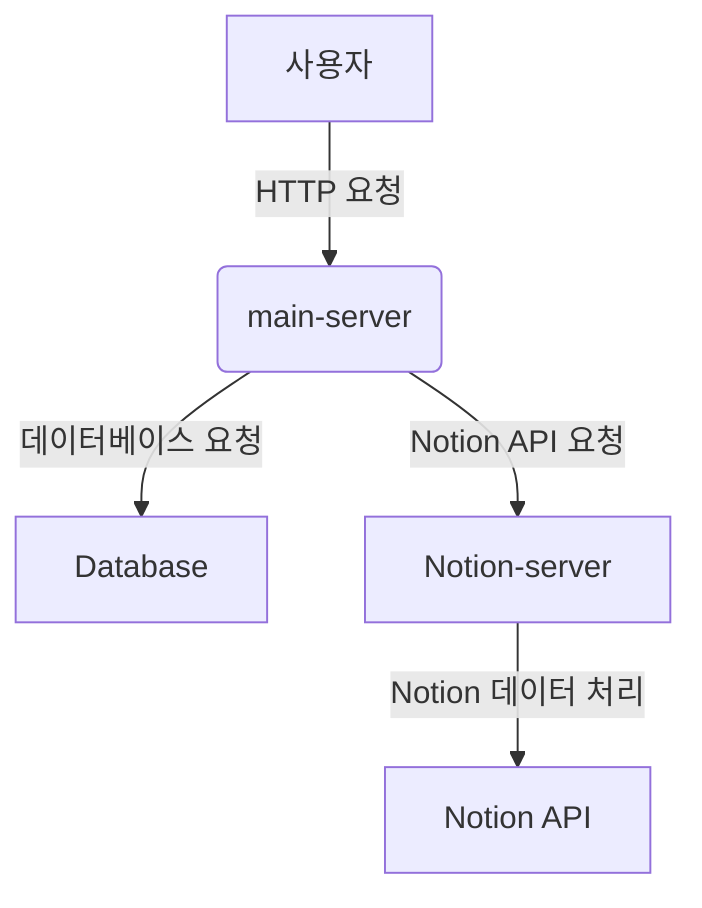

# Conaly API

## 배포된 서버

https://61.109.236.49.nip.io

## 프로젝트 설명

Conaly API는 Express와 TypeScript를 기반으로 구축된 RESTful API입니다. 이 프로젝트는 개발 및 배포 환경 모두에서 Docker와 Docker Compose를 사용하여 손쉽게 설정하고 실행할 수 있습니다.

## 요구 사항

- Node.js 18.x
- Docker
- Docker Compose

## 프로젝트 설정

### 1. 레포지토리 클론

```
git clone <your-repository-url>
cd conaly-api
```

### 2. 환경 변수 설정

프로젝트 루트에 .env 파일을 생성하고 다음 내용을 추가합니다:

```
PORT=8080
MONGO_URI=your_mongo_uri
```

### 3. 의존성 설치

로컬 개발 환경

```
npm install
```

## Docker 설정

## 스크립트

package.json 파일의 스크립트는 다음과 같습니다:

```
"scripts": {
  "build": "tsc",                       // TypeScript 파일을 JavaScript로 컴파일
  "start": "node dist/index.js",        // 컴파일된 파일을 실행
  "dev": "nodemon --exec ts-node src/index.ts"  // 개발 환경에서 사용
}
```

## 애플리케이션 실행

### 개발 환경

개발 환경에서는 docker-compose-dev.yml 파일을 사용하여 컨테이너를 실행합니다:

```
docker-compose -f docker-compose-dev.yml up
```

또는 로컬 환경에서 직접 실행할 수 있습니다:

```
npm run dev
```

### 배포 환경

배포 환경에서는 기본 docker-compose.yml 파일을 사용하여 컨테이너를 실행합니다:

```
docker-compose up
```

배포 환경에서 TypeScript 파일을 컴파일하고 실행하려면 다음 명령어를 사용합니다:

```
npm run build
npm start
```

## 추가 정보

MongoDB 연결: .env 파일에 MONGO_URI를 설정하여 MongoDB에 연결합니다.
포트 설정: 기본적으로 포트 8080에서 애플리케이션이 실행됩니다. 필요한 경우 .env 파일에서 포트를 변경할 수 있습니다.
이 프로젝트에 대한 질문이나 문제가 발생하면 이슈 트래커에 문제를 제출하세요.

이 README 파일은 프로젝트 설정, 개발 및 배포 환경에서의 실행 방법을 포함하여 필요한 모든 정보를 제공합니다. 각 단계에 대한 명확한 설명과 함께 사용 방법을 상세히 설명하여 사용자가 쉽게 따라할 수 있도록 작성되었습니다.

## 서버 구조 및 각 서버의 목표와 기능

### 서버 구조

본 프로젝트는 `main-server`와 `notion-server`로 구성되어 있으며, 배포용 및 개발용 두 가지 환경에서 운영됩니다. 각 서버는 Docker를 사용하여 컨테이너화되어 있으며, `docker-compose`를 통해 배포 및 개발 환경을 설정합니다.

#### 1. main-server

- **배포용**

  - **경로**: `./main-server`
  - **Dockerfile**: `Dockerfile-prod`
  - **포트**: `8080`
  - **환경 변수**: `NODE_ENV=production`
  - **설명**: main-server는 프로덕션 환경에서 Node.js 애플리케이션을 실행합니다. Puppeteer 및 PM2를 사용하여 애플리케이션의 안정적인 실행을 보장합니다.

- **개발용**
  - **경로**: `./main-server`
  - **Dockerfile**: `Dockerfile`
  - **포트**: `8080`
  - **환경 변수**: `NODE_ENV=development`
  - **설명**: 개발 환경에서 nodemon 및 ts-node를 사용하여 코드 변경 시 자동으로 서버를 재시작합니다. 개발 편의를 위해 로컬 디렉토리와 컨테이너 디렉토리를 매핑합니다.

#### 2. notion-server

- **배포용**

  - **경로**: `./notion-server`
  - **Dockerfile**: `Dockerfile-prod`
  - **포트**: `8000`
  - **환경 변수**: `NODE_ENV=production`
  - **설명**: notion-server는 프로덕션 환경에서 Node.js 애플리케이션을 실행합니다. 주로 Notion API와의 연동을 담당합니다.

- **개발용**
  - **경로**: `./notion-server`
  - **Dockerfile**: `Dockerfile`
  - **포트**: `8000`
  - **환경 변수**: `NODE_ENV=development`
  - **설명**: 개발 환경에서 notion-server는 로컬 디렉토리와 컨테이너 디렉토리를 매핑하여 개발 편의를 제공합니다.

### 각 서버의 목표와 기능

#### Main Server

- **목표**

  - 사용자 요청을 처리하고, 데이터베이스와의 상호작용을 담당합니다.
  - 프로덕션 환경에서는 안정적이고 확장 가능한 구조를 유지하며, 개발 환경에서는 신속한 피드백을 제공하는 것이 목표입니다.

- **기능**
  - 사용자 인증 및 권한 관리
  - 데이터베이스 CRUD 작업
  - 외부 API와의 통신
  - 서버 사이드 렌더링 (SSR)

#### Notion Server

- **목표**

  - Notion API와의 통합을 통해 데이터 동기화 및 관리 작업을 수행합니다.
  - 사용자의 Notion 데이터와 애플리케이션의 데이터를 연동하여 통합적인 사용자 경험을 제공하는 것이 목표입니다.

- **기능**
  - Notion API를 통한 데이터 가져오기 및 업데이트
  - Notion 데이터의 로컬 데이터베이스 저장 및 동기화
  - 사용자 인터페이스에 제공할 데이터 가공

### 서버 구조 다이어그램



# 실행 명령어

## notion-server 개발용

1. Docker 이미지 빌드

```

cd ./notion-server
docker build -t notion-server-dev-image -f ./Dockerfile .

```

2. Docker 컨테이너 실행

```

docker run -p 8000:8000 --name notion-server-dev-container --env-file ../.env -e NODE_ENV=development notion-server-dev-image

```

## notion-server 배포용

1. Docker 이미지 빌드

```

cd ./notion-server
docker build -t notion-server-image -f ./Dockerfile-prod .

```

2. Docker 컨테이너 실행

```

docker run -p 8000:8000 --name notion-server-container --env-file ../.env -e NODE_ENV=production notion-server-image

```

## main-server 개발용

1. Docker 이미지 빌드

```

cd ./main-server
docker build -t main-server-dev-image -f ./Dockerfile .

```

2. Docker 컨테이너 실행

```

docker run -p 8080:8080 --name main-server-dev-container --env-file ../.env -e NODE_ENV=development main-server-dev-image

```

## main-server 배포용

1. Docker 이미지 빌드

```

cd ./main-server
docker build -t main-server-image -f ./Dockerfile-prod .

```

2. Docker 컨테이너 실행
   docker run -p 8080:8080 --name main-server-container --env-file ../.env -e NODE_ENV=production main-server-image

## docker-compose 파일 실행 명령어

### 배포용 docker-compose 실행 명령어

1. docker-compose 파일이 있는 디렉토리로 이동

```

cd /path/to/docker-compose-directory

```

2. docker-compose 실행

```

docker-compose up --build

```

### 개발용 docker-compose 실행 명령어

1. docker-compose 파일이 있는 디렉토리로 이동

```

cd /path/to/docker-compose-directory

```

2. docker-compose 실행

```

docker-compose -f docker-compose-dev.yml up --build

```

pip freeze > requirements.txt
docker build -t ai-server-dev-image -f Dockerfile .
docker run -p 4000:4000 --name ai-server-dev-container --env-file ../.env ai-server-dev-image

docker build -t ai-server-dev-image -f Dockerfile-prod .
docker run -p 4000:4000 --name ai-server-container --env-file ../.env ai-server-image
pip freeze > requirements.txt

watchmedo auto-restart --patterns="\*.py" --recursive -- flask run --host=0.0.0.0 --port=4000
